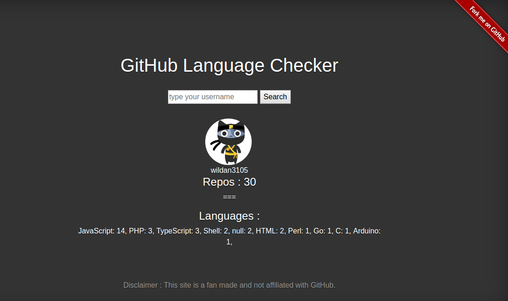

# Github Language Checker

[](https://travis-ci.org/wildan3105/github-langs)
[](https://www.codacy.com/app/wildan3105/github-langs?utm_source=github.com&amp;utm_medium=referral&amp;utm_content=wildan3105/github-langs&amp;utm_campaign=Badge_Grade)
[](http://hits.dwyl.com/wildan3105/github-langs)   [](https://github.com/wildan3105/github-langs/issues)

## 2020!

New year, new resolution. But the vision remains the same though. This year, I'll try to make this repo is completely easy to contribute to. Starting to re-organize the code structure, fix some linter issues, add proper test (unit, integration, and E2E test), also fix some security issues. After those are done, we can plan to add some features (update th UI?, differentiate between fork & original repos, etc). And as always, I'll be very open to any feedbacks/issues/suggestions. Just open an issue or a PR! Thank you and happy coding!

## What ?

> Useful web checker to see what programming languages are used from a github account.

[Go to the web!](https://github-langs.herokuapp.com)



## Why ?

Let everyone know their language statistics on github repo (you can spy on others as well!).

## Key features
- Show statistics of repo's programming language on github account
- Display total of each programming language based on github [programming language color](https://github.com/github/linguist/blob/master/lib/linguist/languages.yml)
- Browse the repo with specific programming language directly from the chart bar
- Ability to display the color in multicolor or single color (white)
- Ability to download the chart in a JPG file
- Social media sharing via facebook & twitter

## Running locally

* [Generate a GitHub OAuth client id and client secret](https://github.com/settings/applications/new) to ensure you don't get rate limited API call.

* Set `process.env` with these values:
```
CLIENT_ID=your_client_id
CLIENT_SECRET=your_client_secret
ENV=local
```

* Install dependency: `npm install`
* Start the app `npm start` and go to `http://localhost:5000`

## Feature tracker:
You can see the feature progress and pick up some issues in the [issues](https://github.com/wildan3105/github-langs/issues) or [projects](https://github.com/wildan3105/github-langs/projects)

## Contributing

Check out this [page](CONTRIBUTING.md)
## Related project(s)
- [Githut](https://github.com/madnight/githut)
- [Hacktoberfest Checker](https://github.com/jenkoian/hacktoberfest-checker)

## License :

MIT (c) Wildan S. Nahar 2017 - 2020
