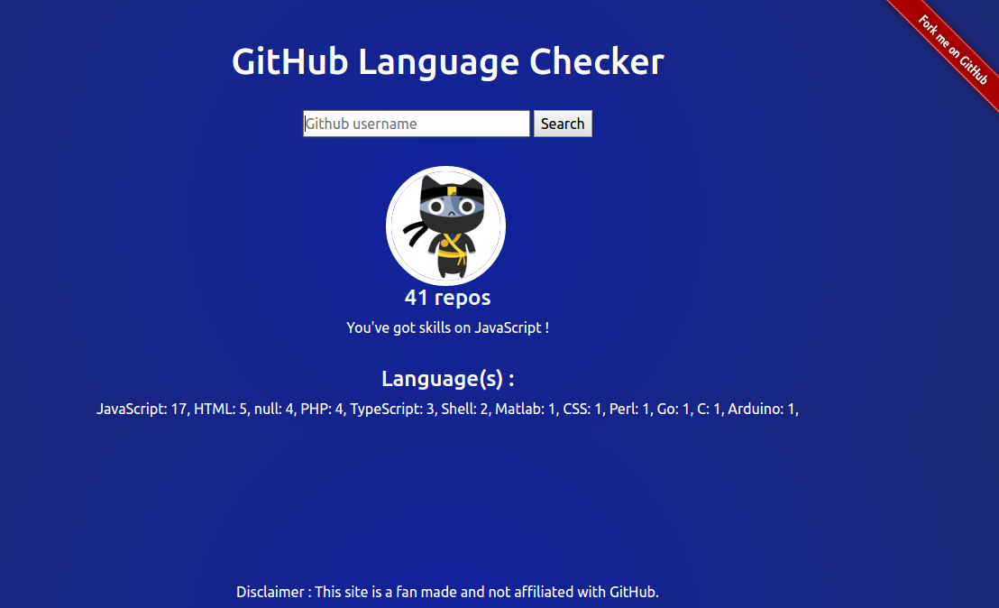

# Github Language Checker

[](https://travis-ci.org/wildan3105/github-langs) [](http://hits.dwyl.com/wildan3105/github-langs)   [](https://github.com/wildan3105/github-langs/issues)


> Useful web checker to see what languages are used from a github account.

[Go to the web!](https://githublangs.herokuapp.com)



## Running the app locally

* [Generate a GitHub OAuth client id and client secret](https://github.com/settings/applications/new) to ensure you don't get rate limited API call.
* Create `.env` file with this content :
```json
CLIENT_ID=your_client_id
CLIENT_SECRET=your_client_secret
```
* Install dependency : `npm install`
* If you want to run test (with eslint) : `npm run test`
* Start the app `npm start` and go to : `http://localhost:5000`

## TO DO LIST :
- [x] : Show repo > 100 (currently, only support repo < 100)
- [x] : Add vertical bar based on languages
- [ ] : Beautify the page

## Contributors :
- [Wildan S. Nahar](https://github.com/wildan3105)
- [Leonardo Cardoso](https://github.com/Leocardoso94)

## License :

MIT (c) Wildan S. Nahar 2017
